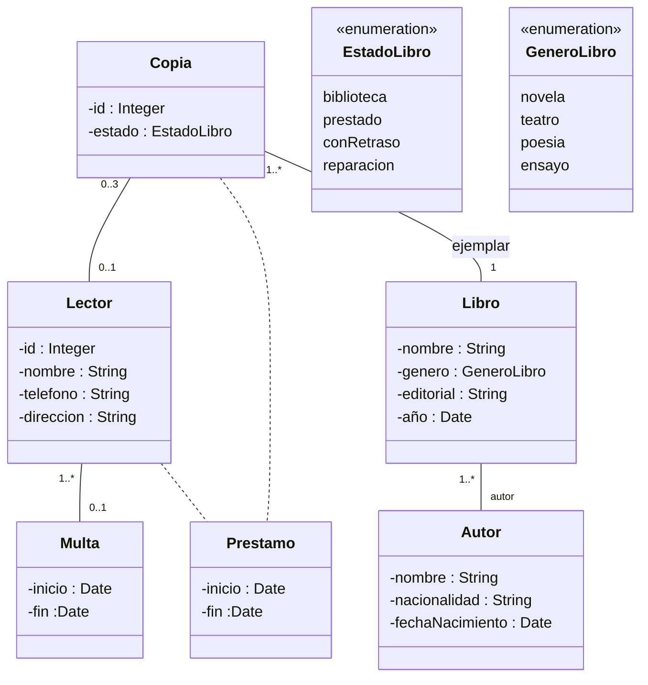

E05-02 Ejercicio UML 2. 
=======================

Biblioteca
----------

<!--Elia Dotor Puente-->

```mermaid
    classDiagram
    Copia "0..3" -- "0..1" Lector
    Lector "1..*" -- "0..1" Multa
    Copia .. Prestamo
    Lector .. Prestamo
    Copia "1..*" -- "1" Libro : ejemplar
    Libro "1..*" -- "autor" Autor

    class Copia{
        -id : Integer
        -estado : EstadoLibro
    }

    class Libro {
        -nombre : String
        -genero : GeneroLibro
        -editorial : String
        -año : Date
    }

    class Autor{
        -nombre : String
        -nacionalidad : String
        -fechaNacimiento : Date
    }

    class Lector{
        -id : Integer
        -nombre : String
        -telefono : String
        -direccion : String

    }

    class Multa{
        -inicio : Date
        -fin :Date
    }
    class Prestamo{
        -inicio : Date
        -fin :Date
    }

    class EstadoLibro { 
        <<enumeration>>
        biblioteca
        prestado
        conRetraso
        reparacion
    }

    class GeneroLibro{
        <<enumeration>>
        novela
        teatro
        poesia
        ensayo
    }

```